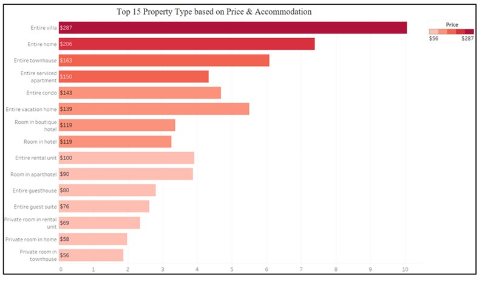
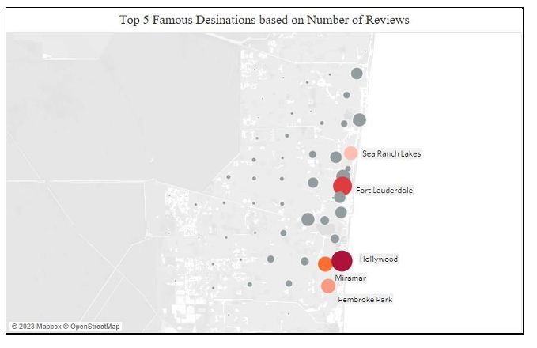
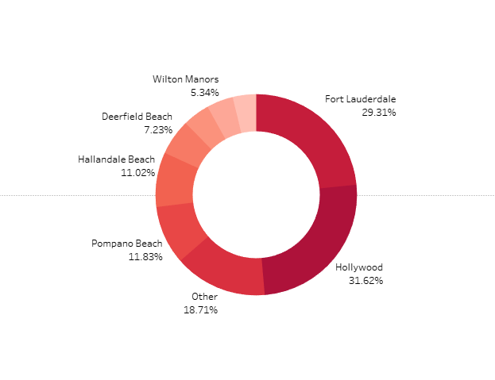

# Airbnb Accommodation Insights: Enhancing Decision-Making for Travelers

# Overview
This project uses advanced data visualization techniques to analyze Airbnb accommodation trends in Broward County, Florida. It offers insights into pricing, location ratings, property types, and optimal booking times, enabling users to make informed choices.
# Project Objectives
• **Visualize Key Metrics:** Average prices, property types, and location-based ratings.

• **Empower Decision-Making:** Enable users to identify the best accommodations based on their preferences.

• **Optimize Planning:** Highlight trends for optimal booking times and cost-effective stays.
#  Tools and Techniques
• **Python:** Data preprocessing and reverse geocoding.

• **Tableau:** Interactive dashboards for visual insights.

• **Excel:** Data transformation and integration.

• **Inside Airbnb:** Primary data source for listings and reviews.
# Key Features
**Interactive Dashboards:**

• Average price per bedroom.

• Most popular property types and locations.

• Optimal travel times for cost-efficient stays.

**Target Audience:**

• Family groups, solo travelers, and friends are looking for tailored accommodation options.

• Hosts seeking data-driven insights for improving listings.

**Visual Highlights:**

• Bar charts, donut graphs, and line charts to showcase trends.

• Maps and tree maps for spatial and hierarchical data visualization.
# Dataset 
• **Source:** Inside Airbnb

• **Description:** Contains listing details, location ratings, pricing, and availability.

• **Size:** Over 1 million rows streamlined to essential 35 fields.
# Key Visualization

  
  
Fig 1: This visualization shows the average price of "Property Type"

  
  
Fig 2: This visualization shows the Top 5 Most Visited Destinations by Reviews

  
  
Fig 3: This visualization shows the total listing data

